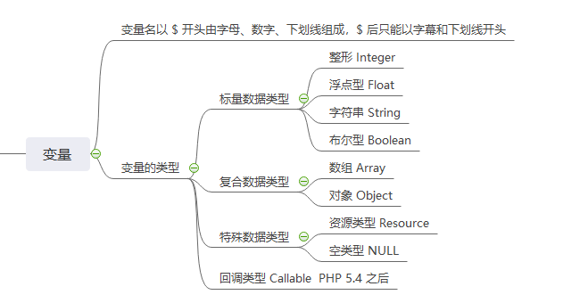

## 变量名
变量名主要以 $ 开头由字母、数字、下划线组成，可以使用字母、下划线开头。

|  变量名 | 是否正确  |
|  ----  | ----  |
|$value_name_01 | √|
|$_value_name_01 | √|
|$01_value_name | ×|

## 变量的类型


## 变量的申明以及检测
因为PHP是脚本语言，变量的类型一般是赋值之后系统会自动判断并分配内存空间，不需要大家像强类型语言一样去显式申明。
```
<?php
// 变量名相关代码

// 申明一个整形变量
$int_value = 10;
// 检测一个变量是否为integer类型 使用PHP提供的函数 is_int() 和 is_integer()，后者是前者的别名
echo '$int_value 是一个浮点类型吗？ 结果：' . var_export(is_int($int_value), true);

echo PHP_EOL; // 命令行换行.

// 申明一个浮点数
$float_value = 10.0;
// 检测一个变量是否为float类型 使用PHP提供的函数 is_float()
echo '$float_value 是一个浮点类型吗？ 结果：' . var_export(is_float($float_value), true);

echo PHP_EOL; // 命令行换行.

// 申明一个字符串
$string_value = "你好！新生活";
// 检测一个变量是否为string类型 使用PHP提供的函数 is_string()
echo '$string_value 是一个字符串类型吗？ 结果：' . var_export(is_string($string_value), true);

echo PHP_EOL;

// 申明一个布尔类型
$boolean_value = false;
// 检测一个变量是否为boolean类型 使用PHP提供的函数 is_bool()
echo '$boolean_value 是一个布尔类型吗？ 结果：' . var_export(is_bool($boolean_value), true);

echo PHP_EOL;

// 申明一个数组类型
/*
 * $array_value = array(1, 2, 3, 4, 5); // 5.4之前的写法
 */
$array_value = [1, 2, 3, 4, 5, 'hello' => 'word']; // 5.4之后新写法
// 检测一个变量是否为数组类型 使用PHP提供函数 is_array()
echo '$array_value 是一个数组类型吗？ 结果：' . var_export(is_array($array_value), true);

echo PHP_EOL;

// 申明一个对象
class Student
{
}

$object_value = new Student();
// 检测一个变量是否为对象类型 使用PHP提供函数 is_object()
echo '$object_value 是一个对象类型吗？ 结果：' . var_export(is_object($object_value), true);

echo PHP_EOL;

// 申明一个资源类型
$resource_value = fopen('./a.txt', 'rb');
// 检测一个变量是否为资源类型 使用PHP提供函数is_resource()
echo '$resource_value 是一个资源类型吗？ 结果：' . var_export(is_resource($resource_value), true);
fclose($resource_value);

echo PHP_EOL;

// 申明一个回调类型
function callable_value() {
    return "Hello World";
};
// 检测一个变量是否为回调类型 使用PHP提供函数is_callable()
echo '$callable_value 是一个回调类型吗？ 结果：' . var_export(is_callable('callable_value', false, $callable_name), true);
```